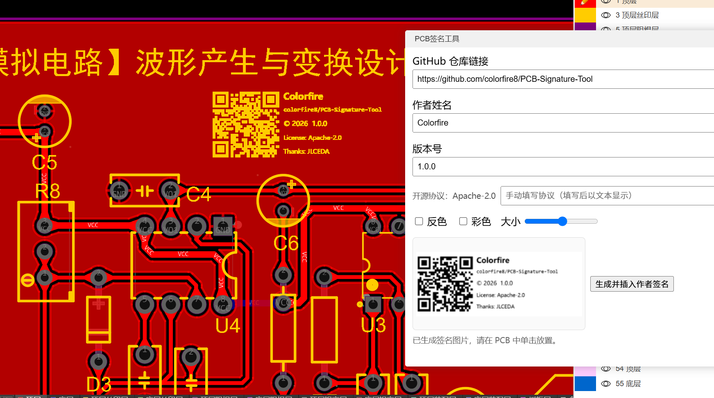

# PCB-Signature-Tool

用于在嘉立创EDA / EasyEDA 的 **PCB 丝印层**生成并插入作者签名信息图，适合在作品板子上留下署名与仓库信息。

仓库：`https://github.com/colorfire8/PCB-Signature-Tool`

## 功能

- **生成签名信息图**：作者、版本号、仓库二维码、`owner/repo`、开源协议、致谢信息
- **插入丝印**：
  - 彩色：以图片对象方式插入 `TOP_SILKSCREEN`
  - 非彩色：矢量化后插入丝印（支持反色）
- **预览与配置保存**：在弹窗内预览效果，并自动保存上次填写的信息（下次打开自动恢复）

## 使用方法

1. 导入插件后，在嘉立创EDA 的 PCB 编辑器中点击：`高级 → PCB签名工具 → PCB签名工具`
2. 填写 GitHub 仓库链接、作者、版本号（可选手动填写协议）
3. 选择 **彩色/反色** 与 **大小**，查看预览
4. 点击“生成并插入作者签名”，按提示在 PCB 画布中单击放置

## 开源许可

Apache-2.0
